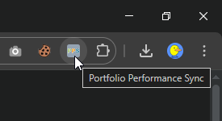
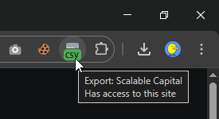
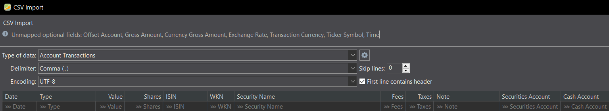

# Portfolio Performance Sync

## Export your entire portfolio with a single click, then import to Portfolio Performance!

> 

## Disclaimer
1. This browser extension is not affiliated with [Portfolio Performance](https://github.com/portfolio-performance/portfolio) or any of its supported
brokers.

2. This browser extension is currently unstable and supports only **Scalable Capital** with these transaction types:

| Category           | Transaction Types                                 |
|--------------------|---------------------------------------------------|
| Security           | Buy, Sell                                         |
| Non-Trade Security | Transfer (Inbound), Transfer (Outbound)           |
| Cash               | Deposit, Dividend, Fees, Interest, Removal, Taxes |

## Install
[//]: # (- [Chrome Web Store]&#40;https://chromewebstore.google.com/detail/hcjficenfcaankcojdbolipbfmimpofh&#41;)
- [Firefox Add-ons](https://addons.mozilla.org/en-US/firefox/addon/portfolio-performance-sync)

### Manual Install
```bash
git clone https://github.com/sebastianstucke87/portfolio-performance-sync.git
cd portfolio-performance-sync
npm install
npm run build
```
#### Chrome
1. In Chrome, open `chrome://extensions`
2. Click `Load unpacked`
3. Select folder `(...)\portfolio-performance-sync\dist\chrome`

#### Firefox
1. In Firefox, open `about:debugging#/runtime/this-firefox`
2. Click `Load Temporary Add-on...`
3. Open `(...)\portfolio-performance-sync\dist\firefox\manifest.json`
4. (Optional) Pin extension to toolbar

## Usage

### 1. Export
1. Login to [scalable.capital/cockpit](https://scalable.capital/cockpit)
2. Click the browser badge to download the CSV:
> 

### 2. Import
1. Open `Portfolio Performance` (may take a little while)
2. Create **a new file (!)** and finish the setup
3. `File` -> `Import` -> `CSV files (...)` and open the CSV
4. The presented CSV Import settings are already correct:
    > 
5. (Optional) When the market values are incorrect, [download historical prices](https://help.portfolio-performance.info/en/how-to/downloading-historical-prices/).
6. (Optional) Delete CSV from download directory

## Is my data safe?
- This browser extension can read browser sessions and intercept web requests to `https://scalable.capital`.
- All intercepted data is processed locally.
- The resulting CSV is in plaintext and downloaded to the download directory.
- 3rd party dependencies are kept to an absolute minimum (see [package.json](package.json)).
- This extension does not send any intercepted data to another recipient (e.g. via [Fetch_API](https://developer.mozilla.org/en-US/docs/Web/API/Fetch_API) or [XMLHttpRequest_API](https://developer.mozilla.org/en-US/docs/Web/API/XMLHttpRequest_API)).
- Report any suspicious side effects immediately.

### As always:
- Any representation of this extension outside of `github.com`, `chrome.google.com` or `addons.mozilla.org` under the namespace `sebastianstucke87` is fraudulent by definition and must be reported immediately.
- This extension is not for sale.

# Reference
- Tests: `$ npm run tests`
- Icon color scheme: https://github.com/portfolio-performance/portfolio/blob/master/CONTRIBUTING.md#color-code-reference
